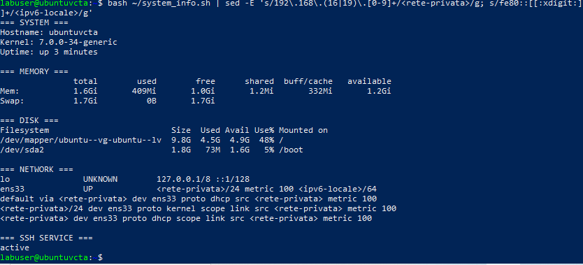

# VMware Network and Snapshot Lab

## Objective

Practice basic VMware Workstation tasks with an Ubuntu Server virtual machine: compare NAT and Host-only networking, verify SSH access, inspect disk usage, and test snapshot restoration.

## Lab environment

- VMware Workstation
- Ubuntu Server virtual machine
- Network adapter tested in NAT and Host-only modes

## Network tests

### NAT

The VM received a private IPv4 address and used a NAT gateway. SSH access from the Windows host succeeded.

### Host-only

The VM received an address on the private Host-only network. The route table showed the Host-only subnet, and SSH access from the Windows host also succeeded.

The network adapter was then returned to NAT.

## Disk usage

The `df -h` command showed:

- Root filesystem `/`: 9.8 GB total, 4.5 GB used, 4.9 GB available (48% used)
- `/boot`: 1.8 GB total, 73 MB used, 1.6 GB available (5% used)

No disk-space issue was found inside the VM.

## Snapshot test

A new snapshot named `Ubuntu NAT baseline - Luca` was created.

A temporary file named `luca_snapshot_test.txt` was created after the snapshot. After reverting to the snapshot, the file was no longer present. This verified that the VM returned to the saved state.

## Evidence

## What I learned

- NAT and Host-only provide different network connections for a virtual machine.
- SSH can be used to access the Ubuntu VM from the Windows host.
- `df -h` reports filesystem capacity and usage.
- VMware snapshots can restore a VM to a saved state.
